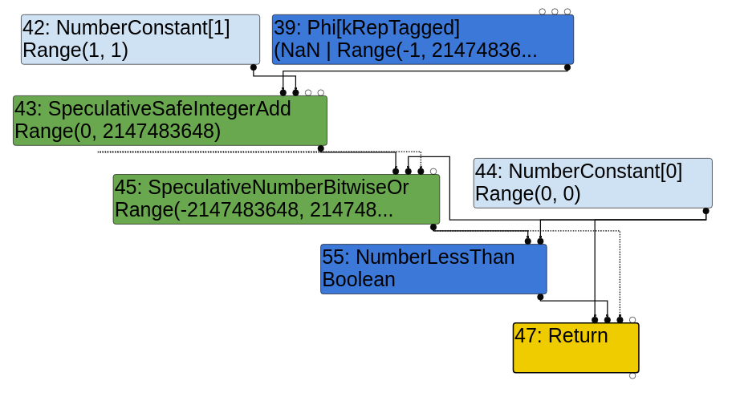
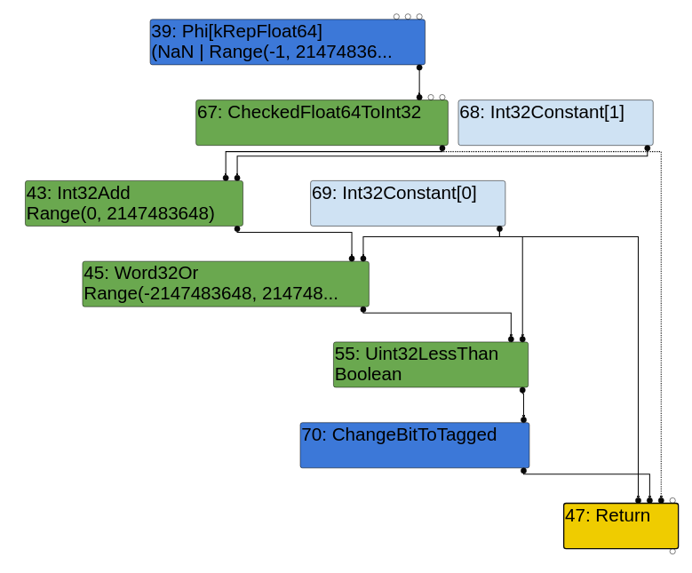
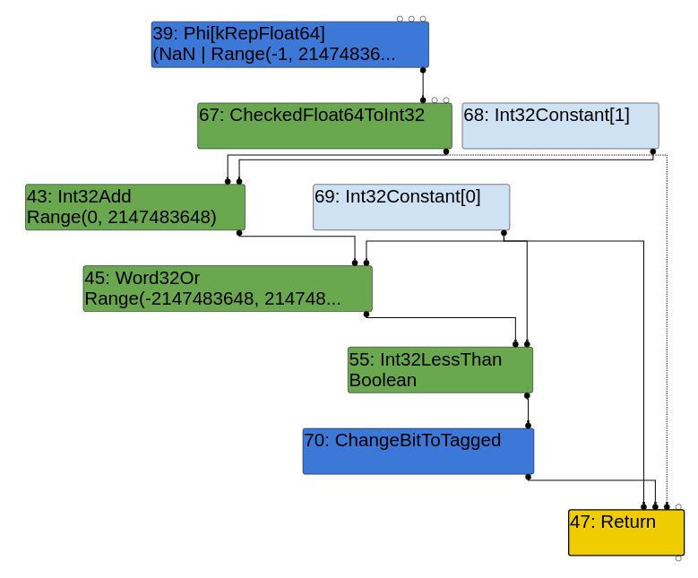
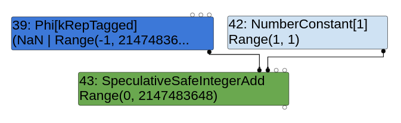
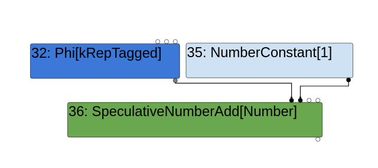
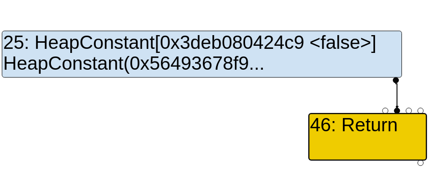

# Introduction

I recently analyzed a really cool N-day vulnerability in V8 and wanted to blog about it since I learned a lot while analyzing it.

# CVE-2020-16040

On the 24th of November, a [very interesting V8 commit](https://chromium-review.googlesource.com/c/v8/v8/+/2557498) was made visible as part of [Chromium Issue 1150649](https://crbug.com/1150649) (which is still restricted). The commit patched a bug in the Simplified Lowering Phase of V8’s optimizing JIT compiler, TurboFan. The latest version of V8 that this bug affects is version **8.9.40**. I will be using this as the unpatched version for analysis, and I will be comparing things like Turbolizer output against version **8.9.41**, where the bug is fixed. 

The patch also included a nice regression test that showcased how to trigger the bug. It did not however grant any immediate exploitable primitives, so some work would need to be done to figure out whether the bug is exploitable at all (and how to exploit it).

Prior to analyzing this bug, I hadn’t really ever looked at the Simplified Lowering Phase in detail, so I took this as the perfect opportunity to learn about it. There was also the added benefit of having to look at all the optimization phases that come *after* the Simplified Lowering Phase in order to figure out whether this bug was exploitable or not. This would mean there would be tons of new things for me to learn, and that’s really all I aim for at the end of the day.

# Background knowledge

Before actually starting to analyze the bug, it is helpful to have some background knowledge of V8 and TurboFan. In this case, having some knowledge of how TurboFan works, and more specifically knowledge of how the Simplified Lowering Phase works would be extremely helpful.

[Jeremy Fetiveau (@__x86)](https://twitter.com/__x86) recently [wrote a blog post that I would highly recommend](https://doar-e.github.io/blog/2020/11/17/modern-attacks-on-the-chrome-browser-optimizations-and-deoptimizations/). It has a section that talks about how the Simplified Lowering Phase works in TurboFan. There are also a few other blog posts on that same blog (as well as online elsewhere) that cover topics like TurboFan’s typer, and etc.

Although I’ll try to explain everything that’s required to understand this specific bug, feel free to refer to other resources to understand what I’m trying to say. Information about complex topics is often really difficult to relay in a manner that’s comprehensible by everyone.

# First steps - what are we given?

The first thing that I always do when analyzing any bug is to take all the information that I initially have about the bug that I’m analyzing, and come up with some exploratory questions that I’ll hopefully be able to answer after I’m done with my analysis. The exploratory nature of the questions should force me to really read a lot of code to come up with the answers.

How does this apply to this bug? Well, for starters, we have the patch, a commit message, and regression test. The regression test especially is very useful. If I didn’t have the regression test handy, then the first thing I’d do is try to figure out how to trigger the bug (which is easier said than done with something as complex as V8 / TurboFan). Since we have the regression test in this case though, I’ll just leave the whole “how to come up with a proof of concept” for another blog post.

Looking at the commit message, we see that it states the following:

```
[compiler] Fix a bug in SimplifiedLowering

SL's VisitSpeculativeIntegerAdditiveOp was setting Signed32 as restriction type even when 
relying on a Word32 truncation in order to skip the overflow check. This is not sound.
```

By itself, without any prior knowledge about the Simplified Lowering Phase, this might be difficult to understand. We do know that the patch modified a function called `VisitSpeculativeIntegerAdditiveOp`, and that it has a nice comment that provides a bit more information:

```diff
+    // Using Signed32 as restriction type amounts to promising there won't be
+    // signed overflow. This is incompatible with relying on a Word32
+    // truncation in order to skip the overflow check.
+    Type const restriction =
+        truncation.IsUsedAsWord32() ? Type::Any() : Type::Signed32();
```

Right here, we have a few different terms such as “restriction type”, “Word32 truncation”, etc, that we have to learn about, but it should be pretty logical to conclude that the effect of the bug is this: the engine makes a promise and says that a signed integer overflow will not take place, but the actual outcome is that a signed integer overflow *does* take place.

Knowing this, let’s have a look at the regression test now. I added my own `assertTrue` and `assertFalse` functions to it so that I could actually run it (I believe ClusterFuzz does this automatically). Here is the modified poc:

```js
// Copyright 2020 the V8 project authors. All rights reserved.
// Use of this source code is governed by a BSD-style license that can be
// found in the LICENSE file.

// Flags: --allow-natives-syntax

function assertTrue(c) {
    if (!c) { throw "Assertion failed"; }
}

function assertFalse(c) {
    assertTrue(!c);
}

function foo(a) {
  var y = 0x7fffffff;  // 2^31 - 1

  // Widen the static type of y (this condition never holds).
  if (a == NaN) y = NaN;

  // The next condition holds only in the warmup run. It leads to Smi
  // (SignedSmall) feedback being collected for the addition below.
  if (a) y = -1;

  const z = (y + 1)|0;
  return z < 0;
}

%PrepareFunctionForOptimization(foo);
assertFalse(foo(true));
%OptimizeFunctionOnNextCall(foo);
assertTrue(foo(false));
```

Looking at the code itself, we can quickly determine the following about the function `foo`:

1. A variable `y` is set to `0x7fffffff`, which is `INT_MAX`.
2. Some TurboFan specific stuff is done which allows the bug to be triggered (we’ll get into all of this later).
3. A variable `z` is set to `(y + 1)|0`.
4. The return statement is supposed to return `false` for the first call to `foo` (The argument `a` will be `true`, so `y` will be set to `-1`, which will cause `z` to be set to `y+1 == -1+1 == 0`), which it does correctly.
5. For the second call to `foo`, `a` will be `false`, so `z` will be set to `y+1 == 0x7fffffff+1 == 0x80000000`. Based on the regression test, it seems this addition should yield the negative number `-2147483648`, which should cause the function to return `true` as this negative number is less than 0.
6. However, if you run this regression test, you’ll see that the final `assertTrue` will fail. We can conclude that the bug supposedly causes the engine to incorrectly assume that an integer overflow hasn’t occurred, when in fact it has (we haven’t verified yet that it has, but we will later).

Based on this information, I came up with the following questions that I will need to have answered after I’ve finished analyzing the bug:

* The “static type” of `y` is widened initially. The question is, how does this work? What is the “static type”, and why does it need to be widened here?
   
* In the warmup run (i.e the initial call to `foo`), `SignedSmall` feedback is collected by setting `y` to `-1`. Again, why is this required here? How does this specific line of code collect `SignedSmall` feedback?

* Why is `z` set to `(y + 1)|0`? More specifically, why is it bitwise OR’d with `0`?

These are the three questions I started with. It's these questions that help give me a goal to work towards. Even though I had the initial goal of “analyse and understand this bug”, it's not as achievable because it's so broad. Specific questions like these allow me to focus on one thing at a time, and as I figure out the answers, I'll slowly figure out the bug itself, which is the real end goal here.

# Unpatched vs Patched Turbolizer graphs

Before I started with answering the questions though, I wanted to quickly compare the Turbolizer graphs between the unpatched and patched versions of V8 to see exactly what effect the patch had on the engine. I won’t go into detail about how to use Turbolizer as there are many blog posts and guides out there.

When I looked at the graphs, I noted that the graphs looked the exact same during the Escape Analysis phase (which runs right before the Simplified Lowering Phase). I'll only be showing the relevant parts of the graph here.

Escape Analysis Phase:



A difference in the graph only shows in the Simplified Lowering Phase. Here are the Simplified Lowering phases of both versions:

Unpatched Simplified Lowering Phase:



Patched Simplified Lowering Phase:



It's immediately evident that the `NumberLessThan` node from the Escape Analysis Phase has been changed to a `Uint32LessThan` node in the unpatched version's Simplified Lowering Phase, whereas it has been changed to an `Int32LessThan` node in the patched version's Simplified Lowering Phase. 

This node is used for the final `return z < 0` comparison. Presumably, the `Uint32LessThan` node means that TurboFan has failed to notice the integer overflow that occurs during the addition, as it attempts to compare the two numbers as unsigned 32-bit integers.

In contrast, the patched version's Simplified Lowering Phase will correctly compare the two numbers as signed 32-bit integers using the `Int32LessThan` node. This is the correct way to do it since the addition does indeed yield a negative number.

# Next steps

At this point, I started ticking the questions off one at a time. The process for this is somewhat tedious, but I just essentially pick one of the questions and do whatever it takes to answer it. 

For example, let's take the first question - **Why is it required to widen the static type of `y`?**

1. Comment out the line of code that widens the static type of `y`. Compare the original Turbolizer graph with the new one. What differences do you see?
2. Trace through the code for both cases, making extensive use of GDB to get debug output (such as to see the nodes' types, see what execution paths are taken, etc).
3. Find the exact point in the code where the execution path starts to differ, note why it starts branching off here. **Take detailed notes**.

I find this the best way to get an in-depth understanding of the code, which allows me to understand the bug in and out. I won't actually go through the entire process step by step for every question though, as that would make for a **very long** blog post. Instead, I'll cover the background knowledge required to answer the questions directly, which is what I assume most readers are here for anyway.

# The Simplified Lowering Phase

The core of the Simplified Lowering Phase's code can be found in `src/compiler/simplified-lowering.cc`. In `src/compiler/pipeline.cc`, you'll note that that the Simplified Lowering Phase runs right after the Escape Analysis Phase:

```c++
bool PipelineImpl::OptimizeGraph(Linkage* linkage) {
  // [ ... ]

  if (FLAG_turbo_escape) {
    Run<EscapeAnalysisPhase>();
    // [ ... ]
  }

  // Perform simplified lowering. This has to run w/o the Typer decorator,
  // because we cannot compute meaningful types anyways, and the computed types
  // might even conflict with the representation/truncation logic.
  Run<SimplifiedLoweringPhase>(linkage);

  // [ ... ]
}
```

This will call into `SimplifiedLowering::Run`, which actually runs three sub-phases:

```c++
  void Run(SimplifiedLowering* lowering) {
    GenerateTraversal();
    RunPropagatePhase();
    RunRetypePhase();
    RunLowerPhase(lowering);
  }
```

`GenerateTraversal` will first put every node in the current graph into a vector called `traversal_nodes_`. It does this by doing a pre-order traversal starting from the `End` node, and pushing each node onto a temporary stack as they're visited. Nodes aren't pushed into the `traversal_nodes_` vector until all nodes have been visited. 

In short, this basically means that the `traversal_nodes_` vector can be iterated over from start to finish, and it'll essentially be the same as visually traversing the Turbolizer graph from top to bottom (this isn't exactly true, but it's a good enough explanation for our purposes).

Next, the three sub-phases will run. In order to debug these sub-phases, the `--trace-representation` flag is really useful, as you'll soon see.

## The Propagation Phase

During this phase, the `traversal_nodes_` vector is traversed in reverse (i.e the first node that is visited will be the `End` node) while "truncations" are propagated through the graph.
  
Truncations can really just be thought of as a label that gets attached to a node. Truncations *may or may not* get propagated to other nodes, depending on certain conditions (such as the types of the nodes, etc). The truncations signify what "representation" a node should be restricted to. You can find a list of truncations defined in the `TruncationKind` enum:

```c++
  enum class TruncationKind : uint8_t {
    kNone,
    kBool,
    kWord32,
    kWord64,
    kOddballAndBigIntToNumber,
    kAny
  };
```

A list of representations can be found in the `MachineRepresentation` enum:

```c++
enum class MachineRepresentation : uint8_t {
  kNone,
  kBit,
  kWord8,
  kWord16,
  kWord32,
  kWord64,
  kTaggedSigned,       // (uncompressed) Smi
  kTaggedPointer,      // (uncompressed) HeapObject
  kTagged,             // (uncompressed) Object (Smi or HeapObject)
  kCompressedPointer,  // (compressed) HeapObject
  kCompressed,         // (compressed) Object (Smi or HeapObject)
  // FP representations must be last, and in order of increasing size.
  kFloat32,
  kFloat64,
  kSimd128,
  kFirstFPRepresentation = kFloat32,
  kLastRepresentation = kSimd128
};
```

This information about a node's representation, truncation, and etc, is stored in a `NodeInfo` object. Each node is associated with a single `NodeInfo` object, which can be accessed by calling `GetInfo(node)` on any `node`:

```c++
class RepresentationSelector {
 public:
  // Information for each node tracked during the fixpoint.
  class NodeInfo final {
   // [ ... ]
   private:
    enum State : uint8_t { kUnvisited, kPushed, kVisited, kQueued };
    State state_ = kUnvisited;
    MachineRepresentation representation_ =
        MachineRepresentation::kNone;             // Output representation.
    Truncation truncation_ = Truncation::None();  // Information about uses.

    Type restriction_type_ = Type::Any();
    Type feedback_type_;
    bool weakened_ = false;
  };
```

Note that when the Simplified Lowering Phase begins, all the fields you see above will be set to their default values (i.e the representation will be `kNone`, the truncation will be `Truncation::None()`, etc). The fields are updated as each sub-phase is completed.

Let's go through a simplified example from the proof of concept code that we're provided with. We'll trace the `SpeculativeSafeIntegerAdd` node as that is the one that contains the bug (based on the patch), but of course I traced a lot more of the graph to really understand everything (which is very important since I don't want to put any wrong information in this blog post :P).

Running `d8` with `--trace-representation`, we get the following output:

```
--{Propagate phase}--
 [ ... ]
 visit #45: SpeculativeNumberBitwiseOr (trunc: truncate-to-word32)
  initial #43: truncate-to-word32
  initial #44: truncate-to-word32
  initial #43: truncate-to-word32
  initial #36: no-value-use
 visit #43: SpeculativeSafeIntegerAdd (trunc: truncate-to-word32)
  initial #39: no-truncation (but identify zeros)
  initial #42: no-truncation (but identify zeros)
  initial #22: no-value-use
  initial #36: no-value-use
 visit #42: NumberConstant (trunc: no-truncation (but identify zeros))
 visit #39: Phi (trunc: no-truncation (but identify zeros))
  initial #32: no-truncation (but identify zeros)
  initial #38: no-truncation (but identify zeros)
  initial #36: no-value-use
 [ ... ]
```

You can see that the `SpeculativeNumberBitwiseOr` node will propagate a `Word32` truncation to its first input (`#43`, the `SpeculativeSafeIntegerAdd` node), which will in turn propagate no truncations to its first two inputs. 

`RunPropagatePhase` will iterate over the `traversal_nodes_` vector backwards, and call `PropagateTruncation` on each node, which will in turn call `VisitNode<PROPAGATE>` on each node that is traversed. 

For the `SpeculativeSafeIntegerAdd` node, `VisitNode` calls `VisitSpeculativeIntegerAdditiveOp`:

```c++
  template <Phase T>
  void VisitNode(Node* node, Truncation truncation,
                 SimplifiedLowering* lowering) {
    // [ ... ]
    switch (node->opcode()) {
      // [ ... ]
      case IrOpcode::kSpeculativeSafeIntegerAdd:
      case IrOpcode::kSpeculativeSafeIntegerSubtract:
        return VisitSpeculativeIntegerAdditiveOp<T>(node, truncation, lowering);
      // [ ... ]
    }
  }
```

`VisitSpeculativeIntegerAdditiveOp` is a bit of a long function, so I'll only show the relevant parts (and trim out any comments as well):

```c++
  template <Phase T>
  void VisitSpeculativeIntegerAdditiveOp(Node* node, Truncation truncation,
                                         SimplifiedLowering* lowering) {
    Type left_upper = GetUpperBound(node->InputAt(0));
    Type right_upper = GetUpperBound(node->InputAt(1));

    // [ 1 ]
    if (left_upper.Is(type_cache_->kAdditiveSafeIntegerOrMinusZero) &&
        right_upper.Is(type_cache_->kAdditiveSafeIntegerOrMinusZero)) {
      // [ ... ]
    }

    // [ ... ]
    return;
  }
```

First, the `left_upper` and `right_upper` variables are essentially just the types of the first two input nodes that you see on the Turbolizer graph. In this case, these are:



So we have the following:

* `left_upper` - The type of the `Phi` node, which is a `UnionType` of `NaN | Range(-1, 2147483647)`.
* `right_upper` - The type of the `NumberConstant[1]` node, which is a `RangeType` of `Range(1, 1)`.

Next, the `if` branch at `[ 1 ]` will not be taken because the first check will fail. `type_cache_->kAdditiveSafeIntegerOrMinusZero` is a `UnionType` between a `Type::MinusZero()` and a `Range(-4503599627370496, 4503599627370496)`, **which doesn't include `NaN`**. This causes the `left_upper.Is(...)` call to return `false`.

This actually answers our first question. We know that the static type of `y` was widened by setting it to `NaN`. Since the first `if` statement is skipped specifically due to this reason, we can infer that this is done in order to get past the `if` statement (the function returns within the `if` branch and doesn't go any further). This is further confirmed by the patch, as the only modificaitons made to this function by the patch come *after* this `if` branch.

We can then also infer what a "static type" really is. In this case, it seems like the static type is the type that is shown on the Turbolizer graph (i.e previously typed by the Typer Phase). The feedback type (tracked in the `NodeInfo` class) on the other hand seems to be a Simplified Lowering Phase specific thing (we'll look at it in more detail soon).

Next, we get to the following code, which helps answer our second question:

```c++
  template <Phase T>
  void VisitSpeculativeIntegerAdditiveOp(Node* node, Truncation truncation,
                                         SimplifiedLowering* lowering) {
    // [ ... ]
    NumberOperationHint hint = NumberOperationHintOf(node->op());
    DCHECK(hint == NumberOperationHint::kSignedSmall ||
           hint == NumberOperationHint::kSigned32);

    // [ ... ]
    return;
  }
```

We see that the `SpeculativeSafeIntegerAdd` node's `NumberOperationHint` is stored into `hint`, and a `DCHECK` ensures that the hint is either `kSignedSmall` or `kSigned32`. This tells us that in order to actually reach this code, we need either `SignedSmall` or `Signed32` feedback. Now we know why the proof of concept makes it a point to collect `SignedSmall` feedback in the warmup run.

We can verify this by first modifying the poc to remove the collection of the `SignedSmall` feedback, then tracing the code. First, if you look at the Turbolizer graph for the modified poc, you'll see that a `SpeculativeNumberAdd` node (not the same as the `SpeculativeSafeIntegerAdd` node!) will be inserted during the Graph Builder Phase:



This will make the bug impossible to trigger since a `SpeculativeNumberAdd` node does not call `VisitSpeculativeIntegerAdditiveOp` during the Simplified Lowering Phase.

The code that decides between a `SpeculativeSafeIntegerAdd` and a `SpeculativeNumberAdd` node can be found within the JS Type Hint Lowering reducer (is it even called a reducer? I'm not sure :p). This runs during the Graph Builder Phase:

```c++
  const Operator* SpeculativeNumberOp(NumberOperationHint hint) {
    switch (op_->opcode()) {
      case IrOpcode::kJSAdd:
        if (hint == NumberOperationHint::kSignedSmall ||
            hint == NumberOperationHint::kSigned32) {
          return simplified()->SpeculativeSafeIntegerAdd(hint);
        } else {
          return simplified()->SpeculativeNumberAdd(hint);
        }
      // [ ... ]
    }
    UNREACHABLE();
  }
```

This feedback can be seen being collected by Ignition (not important to trace this code, but I like answering every question thoroughly):

```c++
TNode<Object> BinaryOpAssembler::Generate_AddWithFeedback(
    TNode<Context> context, TNode<Object> lhs, TNode<Object> rhs,
    TNode<UintPtrT> slot_id, TNode<HeapObject> maybe_feedback_vector,
    bool rhs_known_smi) {
  // [ ... ]

    {
      // [ ... ]
      {
        var_type_feedback = SmiConstant(BinaryOperationFeedback::kSignedSmall); // This
        UpdateFeedback(var_type_feedback.value(), maybe_feedback_vector,
                       slot_id);
        var_result = smi_result;
        Goto(&end);
      }

      // [ ... ]
    }
  }
  // [ ... ]
```

So, to summarize, `SignedSmall` feedback needs to be collected in order for a `SpeculativeSafeIntegerAdd` node to be inserted into the graph. This is the node that triggers the vulnerable function `VisitSpeculativeIntegerAdditiveOp` during the Simplified Lowering Phase.

With that out of the way, let's look at the next part of `VisitSpeculativeIntegerAdditiveOp`:

```c++
  template <Phase T>
  void VisitSpeculativeIntegerAdditiveOp(Node* node, Truncation truncation,
                                         SimplifiedLowering* lowering) {
    // [ ... ]

    Type left_constraint_type =
        node->opcode() == IrOpcode::kSpeculativeSafeIntegerAdd
            ? Type::Signed32OrMinusZero()
            : Type::Signed32();
    if (left_upper.Is(left_constraint_type) && /*[ ... ]*/) { // [ 1 ]
      // [ ... ]
    } else {
      IdentifyZeros left_identify_zeros = truncation.identify_zeros();
      if (node->opcode() == IrOpcode::kSpeculativeSafeIntegerAdd && // [ 2 ]
          !right_feedback_type.Maybe(Type::MinusZero())) {
        left_identify_zeros = kIdentifyZeros;
      }
      UseInfo left_use = CheckedUseInfoAsWord32FromHint(hint, FeedbackSource(),
                                                        left_identify_zeros);
      UseInfo right_use = CheckedUseInfoAsWord32FromHint(hint, FeedbackSource(),
                                                         kIdentifyZeros);
      VisitBinop<T>(node, left_use, right_use, MachineRepresentation::kWord32,
                    Type::Signed32());
    }

    // [ ... ]
    return;
  }
```

The `if` branch at `[ 1 ]` will not be taken since `left_upper.Is(Type::Signed32OrMinusZero())` will return false due to the same reason as above (`left_upper` has a `NaN` type in it). We then get to the `else` branch.

Before continuing, I'll briefly explain what "identifying zeros" vs "distinguishing zeros" means. Essentially, any truncation can have either of these properties - to identify zeros or to distinguish between zeros. There is no real explanation (in the form of code comments or other blog posts) about this, but what I've inferred from reading a lot of the code is the following:

* Identify Zeros - This is the "default" option for most truncations.
* Distinguish zeros - This option seems to be used any time a truncation is being done on a node where distinguishing between `0` and `-0` is important.

The `truncation` argument that is passed into this function is the currently set truncation of the `SpeculativeSafeIntegerAdd` node. Remember that this is the first time the node has been visited, so the truncation will be a `TruncationKind::kNone`. This in turn means that `left_identify_zeros` will be set to `kIdentifyZeros` no matter whether the `if` branch at `[ 2 ]` is taken or not. 

Then, it will create `UseInfo` objects for the first and second input nodes using the `SignedSmall` hint. `CheckedUseInfoAsWord32FromHint` will call into `CheckSignedSmallAsWord32` for both inputs:

```c++
  static UseInfo CheckedSignedSmallAsWord32(IdentifyZeros identify_zeros,
                                            const FeedbackSource& feedback) {
    return UseInfo(MachineRepresentation::kWord32,
                   Truncation::Any(identify_zeros), TypeCheckKind::kSignedSmall,
                   feedback);
  }
```

We see that the `UseInfo` for both of the inputs have truncations set to `Truncation::Any(identify_zeros)`, where `identify_zeros` will be `kIdentifyZeros` in both cases. This does indeed match the `--trace-representation` output from earlier: neither of the first two inputs of the `SpeculativeSafeIntegerAdd` node are truncated.

Finally, `VisitBinop` is called. This is as follows:

```c++
  template <Phase T>
  void VisitBinop(Node* node, UseInfo left_use, UseInfo right_use,
                  MachineRepresentation output,
                  Type restriction_type = Type::Any()) {
    DCHECK_EQ(2, node->op()->ValueInputCount());
    ProcessInput<T>(node, 0, left_use);
    ProcessInput<T>(node, 1, right_use);
    for (int i = 2; i < node->InputCount(); i++) {
      EnqueueInput<T>(node, i);
    }
    SetOutput<T>(node, output, restriction_type);
  }
```

The first two input nodes are processed using the `left_use` and `right_use` arguments. `ProcessInput` will call into `EnqueueInput`, which will essentially check whether the inputs have been visited before. If they haven't (which is the case here), then they are marked with the truncations that are set within `left_use` and `right_use` respectively (`Truncation::Any()`). If they had been visited before, then they may or may not be added to a "revisit queue" to be revisited later (not applicable here).

Finally, any other existing inputs have `EnqueueInput` called on them (the third argument, if not provided, is set to `UseInfo::None()`). `SetOutput` will then set the `SpeculativeSafeIntegerAdd` node's output representation to `kWord32`, and its restriction type to `Type::Signed32()`.

Note that this call to `VisitBinop` is one of the lines that was modified by the patch. We'll see how the bug manifests because of this in the next sub-phase.

Every single node in the graph is visited in the same fashion as the `SpeculativeSafeIntegerAdd` node during the Propagation Phase. Once this has been done, the "revisit queue" mentioned earlier will be traversed once if it isn't empty. After that, the Propagation Phase ends, and the Retype Phase begins.

## The Retype Phase

During this phase, the `traversal_nodes_` vector is traversed from start to finish. For each node that is visited, a new type is created using the types of the current node's inputs. Finally, this new type is intersected with the current node's restriction type (which was set during the Propagation Phase), and then the current node's feedback type (which can be found in its `NodeInfo` object) is updated with the new type.

Let's again look at the `SpeculativeSafeIntegerAdd` node as an example. The `--trace-representation` output tells us the following:

```
--{Retype phase}--
[ ... ]
#39:Phi[kRepTagged](#32:Phi, #38:NumberConstant, #36:Merge)  [Static type: (NaN | Range(-1, 2147483647))]
 visit #39: Phi                                                                 
  ==> output kRepFloat64                                                        
 visit #42: NumberConstant                                                      
  ==> output kRepTaggedSigned                                                   
#43:SpeculativeSafeIntegerAdd[SignedSmall](#39:Phi, #42:NumberConstant, #22:SpeculativeNumberEqual, #36:Merge)  [Static type: Range(0, 2147483648), Feedback type: Range(0, 2147483647)]
 visit #43: SpeculativeSafeIntegerAdd                                           
  ==> output kRepWord32
[ ... ]
```

We see that the first two inputs of the `SpeculativeSafeIntegerAdd` (which are the `Phi` and `NumberConstant` nodes) have both been retyped already. One thing to note here is that a `Feedback type` shown in the `--trace-representation` output essentially means that a new type **that is different to the original static type** was generated during the Retype phase for that specific node.

What do I mean by this? Well, let's take the `Phi` node as an example here. We see that only a static type is shown in the `--trace-representation` output above, but this is slightly misleading, as it makes it seem like no feedback type was generated. However, this is incorrect. The `Phi` node has already been retyped, and its `NodeInfo` object will have its `feedback_type_` field updated to `NaN | Range(-1, 2147483647)`. It's just not shown in the output because the newly retyped type is the same as the original static type.

We also note that the `Phi` node's output representation is set to `kRepFloat64` (this is due to the `NaN` type), and that the `NumberConstant` node's output representation is set to `kRepTaggedSigned` (it's treated as an uncompressed Smi).

Let's try to see how the `SpeculativeSafeIntegerAdd` node gets retyped, and why it has a feedback type that's different to its static type. Remember that the restriction type for this node has been set to `Type::Signed32()`, and its output representation is `kWord32`. 

The `RunRetypePhase` function calls `RetypeNode` as follows:

```c++
  void RunRetypePhase() {
    TRACE("--{Retype phase}--\n");
    ResetNodeInfoState();
    DCHECK(revisit_queue_.empty());

    for (auto it = traversal_nodes_.cbegin(); it != traversal_nodes_.cend();
         ++it) {
      Node* node = *it;
      if (!RetypeNode(node)) continue;

      // Maybe revisit nodes if needed, not important
      // [ ... ]
    }
  }

  bool RetypeNode(Node* node) {
    NodeInfo* info = GetInfo(node);
    info->set_visited();
    bool updated = UpdateFeedbackType(node);
    TRACE(" visit #%d: %s\n", node->id(), node->op()->mnemonic());
    VisitNode<RETYPE>(node, info->truncation(), nullptr);
    TRACE("  ==> output %s\n", MachineReprToString(info->representation()));
    return updated;
  }
```

`RetypeNode` will first mark the node as "visited". Then, it will attempt to update the feedback type of the node using `UpdateFeedbackType`. Let's look at how this works:

```c++
  bool UpdateFeedbackType(Node* node) {
    if (node->op()->ValueOutputCount() == 0) return false;

    if (node->opcode() != IrOpcode::kPhi) { // [ 1 ]
      // [ ... ]
    }

    NodeInfo* info = GetInfo(node);
    Type type = info->feedback_type();
    Type new_type = NodeProperties::GetType(node);

    // We preload these values here to avoid increasing the binary size too
    // much, which happens if we inline the calls into the macros below.
    Type input0_type;
    if (node->InputCount() > 0) input0_type = FeedbackTypeOf(node->InputAt(0));
    Type input1_type;
    if (node->InputCount() > 1) input1_type = FeedbackTypeOf(node->InputAt(1));

    switch (node->opcode()) {
      // [ ... ]
#define DECLARE_CASE(Name)                                               \
  case IrOpcode::k##Name: {                                              \
    new_type = Type::Intersect(op_typer_.Name(input0_type, input1_type), \
                               info->restriction_type(), graph_zone());  \
    break;                                                               \
  }
      SIMPLIFIED_SPECULATIVE_NUMBER_BINOP_LIST(DECLARE_CASE)
      SIMPLIFIED_SPECULATIVE_BIGINT_BINOP_LIST(DECLARE_CASE)
#undef DECLARE_CASE

      // [ ... ]
    }
    new_type = Type::Intersect(GetUpperBound(node), new_type, graph_zone());

    if (!type.IsInvalid() && new_type.Is(type)) return false;
    GetInfo(node)->set_feedback_type(new_type);
    if (FLAG_trace_representation) {
      PrintNodeFeedbackType(node);
    }
    return true;
  }
```

The first `if` branch at `[ 1 ]` essentially ensures that every single input of this node has been retyped already **unless the node is a `Phi` node**. In our case, this is true, so we can safely ignore it.

Next, we have two `Type` variables. `type` is the current feedback type of the node (which doesn't exist since this is the first time the node is being visited in the Retype Phase), while `new_type` is the current static type of the node (which is `Range(0, 2147483648)` from the Turbolizer graph).

Next, the feedback type of both inputs are stored in `input0_type` and `input1_type`. In this case, they're as follows:

* `input0_type`: `NaN | Range(-1, 2147483647)` - The `Phi` node
* `input1_type`: `Range(1, 1)` - The `NumberConstant[1]` node

Next, we get into a huge `switch` statement that makes extensive use of macros. In our case, we're interested in the one that handles `SIMPLIFIED_SPECULATIVE_NUMBER_BINOP_LIST`. In our case, the `new_type = ...` macro line essentially just translates to the following:

```c++
new_type =
    Type::Intersect(OperationTyper::SpeculativeSafeIntegerAdd(input0_type, input1_type), 
                    info->restriction_type(), graph_zone());
```

Here, `new_type` is essentially being set to a new intersection type, which is the intersection between the current node's restriction type (which is `Type::Signed32()`, set during the Propagation Phase), and the type returned by `OperationTyper::SpeculativeSafeIntegerAdd`.

`OperationTyper::SpeculativeSafeIntegerAdd` is really simple. It will ignore the `NaN` type in `input0_type` and simply add the Min and Max of the ranges together, and return a new `RangeType`. Essentially, this returns a `Range(-1+1, 2147483647+1)` == `Range(0, 2147483648)`.

Finally, when this new range is intersected with the restriction type, a final type of `Range(0, 2147483647)` is returned, which is what `new_type` gets set to. Feel free to trace through the code in `Type::Intersect` yourself, and you'll see how this works, but in short: `Type::Signed32()` (i.e the restriction type) can be thought of as a `Range(-2147483648, 2147483647)`. When intersected with `Range(0, 2147483648)`, the highest minimum and the lowest maximum is returned, which results in `Range(0, 2147483647)`.

At the very end of the function, the final `Type::Intersect` won't affect `new_type` (again, can be verified by tracing the code). Then, the current node's feedback type is set to this new range (`new_type.Is(type)` will return false since `type` is the feedback type, which is non-existent at this point). Note that in this case, the feedback type will be printed out in the `--trace-representation` output because it differs from the original static type.

**This is the manifestation of the bug right here**. The feedback type is set to `Range(0, 2147483647)`, which is obviously incorrect. `input0_type`'s type was a `Range(-1, 2147483647)`. If it is the highest possible value (which it is in this case, `0x7fffffff` in the poc), then adding `1` to it will cause it to become `2147483648`, which will wrap around to `-2147483648`. This is not being covered in the final computed range that's being set as the node's feedback type.

This can be seen by returning and printing `z` from within the poc:

```js
function foo(a) {
  // [ ... ]
  return z;
}

%PrepareFunctionForOptimization(foo);
foo(true);
%OptimizeFunctionOnNextCall(foo);
print(foo(false));
```

```
$ ./d8 --allow-natives-syntax poc.js 
-2147483648
```

The root cause behind this is due to the restriction type being set to `Type::Signed32()`. Indeed, if you look at the patch, you'll note that it addresses this by setting the restriction type in `VisitSpeculativeIntegerAdditiveOp` to `Type::Any()` whenever the truncation is set to `kWord32`.

After this has been done, back in `RetypeNode`, `VisitNode` may or may not be called. In this case, it will, but `VisitNode<RETYPE>` just sets the current node's output representation to `kWord32`, so nothing new really happens.

Once every single node has been retyped, some nodes may need to be revisited (similar to the Propagation Phase). After this is done, the Retype Phase ends, and the Lowering Phase begins.

## The Lowering Phase

I'll just summarize what happens in this phase since the bug has already been explained, although I should note that I did trace this phase as well just to make sure I understood it correctly.

Essentially, `RunLowerPhase` will iterate through the `traversal_nodes_` vector from the start to the end, and call `VisitNode<LOWER>` on each node. This will lower the node into a lower level node based on all the information that has been collected in the previous two sub-phases. 

For example, our `SpeculativeSafeIntegerAdd` node will be incorrectly lowered to an `Int32Add`, when in reality it should be lowered to a `CheckedInt32Add` due to the signed integer overflow.

This also explains why the `NumberLessThan` node is replaced with a `Uint32LessThan` node in the Simplified Lowering Phase of the unpatched version's Turbolizer graph. Since the engine thinks no overflow can possibly occur, it won't bother with comparing signed integers. This can actually be seen in `VisitNode` inside the huge `switch` statement:

```c++
      case IrOpcode::kNumberLessThan:
      case IrOpcode::kNumberLessThanOrEqual: {
        Type const lhs_type = TypeOf(node->InputAt(0));
        Type const rhs_type = TypeOf(node->InputAt(1));
        // Regular number comparisons in JavaScript generally identify zeros,
        // so we always pass kIdentifyZeros for the inputs, and in addition
        // we can truncate -0 to 0 for otherwise Unsigned32 or Signed32 inputs.
        if (lhs_type.Is(Type::Unsigned32OrMinusZero()) &&
            rhs_type.Is(Type::Unsigned32OrMinusZero())) {
          // => unsigned Int32Cmp
          VisitBinop<T>(node, UseInfo::TruncatingWord32(),
                        MachineRepresentation::kBit);
          if (lower<T>()) NodeProperties::ChangeOp(node, Uint32Op(node));
        } else if (/*[ ... ]*/) {
            // [ ... ]
        }
        return;
      }
```

Here, `lhs` will be the feedback type of the `SpeculativeNumberBitwiseOr` node, which will be `Range(0, 2147483647)`, while `rhs` will be a `Range(0, 0)`. Since both of these types fit in an `Unsigned32`, the first `if` branch will be taken. As you can see, during the Lowering Phase, `if (lower<T>())` will return true, and the current node will be changed to its `Uint32` version.

One thing you'll notice is that the feedback type of the `SpeculativeNumberBitwiseOr` node, as mentioned in the previous paragraph, will be a `Range(0, 2147483647)`. If you compare this to the Turbolizer graph in the Simplified Lowering Phase, you'll see that the graph actually shows a `Range(INT_MIN, INT_MAX)` for the lowered `Word32Or` node. The reason this happens is because the static types of the nodes are never updated with the new feedback types, so the types on the Turbolizer graph are never updated. This further proves that the static type of a node is indeed what you see on the Turbolizer graph.

This non-visual feedback typing can get confusing very quickly, but you can figure it out pretty quickly using GDB. For example, to figure out the feedback type of the `SpeculativeNumberBitwiseOr` node when the `NumberLessThan` node is being visited during the Lowering Phase, you can do the following:

1. Set a breakpoint on `RunLowerPhase`, run the poc until that breakpoint is hit.
2. Set a breakpoint after the `Type const lhs_type = ...` line in the code block above. Continue until this breakpoint is hit.

Now, since you know that the `lhs_type` will be a `RangeType`, you can print it out in GDB as follows:

```
gef➤  p *(RangeType *) lhs_type
$2 = {
  <v8::internal::compiler::TypeBase> = {
    kind_ = v8::internal::compiler::TypeBase::kRange
  }, 
  members of v8::internal::compiler::RangeType: 
  bitset_ = 0x402, 
  limits_ = {
    min = 0, 
    max = 2147483647
  }
}
```

You can of course trace the code as well to see exactly how the `SpeculativeNumberBitwiseOr` node is retyped during the Retype Phase, and you'll come to the same conclusion as above.

# One question left unanswered

We still haven't answered our third question: **Why is it required to do the bitwise OR in the first place?**

To answer this, let's modify the poc to remove the bitwise OR. If you do this and run the poc, you'll see that the output for the second call to `foo` will still return `false`, which means the bug was triggered successfully, so what's changed?

Let's check the Turbolizer graph. You'll notice that the `SpeculativeNumberLessThan` node is replaced with a `HeapConstant[false]` during the Typed Lowering Phase:



This is correct as it means the engine thinks that the previous addition will never yield a number less than 0, and so the Constant Folding reducer will constant fold the node into a false `HeapConstant`. 

The core reason behind why this happens has to do with the fact that the first input node of the `SpeculativeNumberLessThan` node (which is the addition node) is typed as a `Range(0, 2147483648)` during the Typer Phase. When the Typer attempts to type the `SpeculativeNumberLessThan` node afterwards, `Typer::Visitor::NumberCompareTyper` is called:

```c++
Typer::Visitor::ComparisonOutcome Typer::Visitor::NumberCompareTyper(Type lhs,
                                                                     Type rhs,
                                                                     Typer* t) {
  DCHECK(lhs.Is(Type::Number()));
  DCHECK(rhs.Is(Type::Number()));

  if (lhs.IsNone() || rhs.IsNone()) return {};

  // Shortcut for NaNs.
  if (lhs.Is(Type::NaN()) || rhs.Is(Type::NaN())) return kComparisonUndefined;

  ComparisonOutcome result;
  if (lhs.IsHeapConstant() && rhs.Is(lhs)) {
    // Types are equal and are inhabited only by a single semantic value.
    result = kComparisonFalse;
  } else if (lhs.Min() >= rhs.Max()) {
    result = kComparisonFalse;
  } else if (lhs.Max() < rhs.Min()) {
    result = kComparisonTrue;
  } else {
    return ComparisonOutcome(kComparisonTrue) |
           ComparisonOutcome(kComparisonFalse) |
           ComparisonOutcome(kComparisonUndefined);
  }
  // Add the undefined if we could see NaN.
  if (lhs.Maybe(Type::NaN()) || rhs.Maybe(Type::NaN())) {
    result |= kComparisonUndefined;
  }
  return result;
}
```

In this case, we have `lhs` == `Range(0, 2147483648)` (this is the type of the addition node), and `rhs` == `Range(0, 0)`. Looking at the `if`-`else if` branches, it's obvious that the `lhs.Min() >= rhs.Max()` branch will be taken, which will set the `result` to a `kComparisonFalse`. This is what leads the engine to think that the comparison will never return true.

Compare this to when the `SpeculativeNumberBitwiseOr` node is inserted in the original poc. The bitwise OR will widen the range of the `SpeculativeSafeIntegerAdd` node to `Range(INT_MIN, INT_MAX)` (because that's what bitwise OR'ing with `0` does). When this happens, `lhs.Min() >= rhs.Max()` will fail. `lhs.Max() < rhs.Min()` will also fail, so the final result that is returned is a combination of `true`, `false`, and `undefined`. This means that the engine cannot determine for a fact that the comparison will return `false` every single time, and so the Constant Folding reducer cannot replace the `SpeculativeNumberLessThan` node with a false `HeapConstant` anymore.

So we can conclude that the bitwise OR really isn't needed to trigger the bug. It would really only matter if your method of exploitation depends on NOT constant folding the `SpeculativeNumberLessThan` node to a false `HeapConstant`.

Now, is this bug exploitable?

# Exploitability

Since the bug occurs during the Simplified Lowering Phase, we can actually use the incorrectly typed `SpeculativeSafeIntegerAdd` node to propagate more incorrect types to subsequent nodes during the Retype Phase. I spent a little bit of time figuring out what some of the phases after the Simplified Lowering Phase actually do to the nodes, but could not find a way to exploit the bug as it is. I am planning to spend a lot more time trying to figure out how to exploit this bug though, as I do believe it's exploitable.

I experimented a lot with the original poc and was able to get the engine to hit a trap within TurboFan compiled code in multiple ways (which essentially means the bug got triggered in a way that crashes the engine). One of the ways this can be done is shown below:

```c++
function foo(a) {
  var y = 0x7fffffff;  // 2^31 - 1

  if (a == NaN) y = NaN;

  if (a) y = -1;

  let z = y + 1; // z = -2147483648, static type = Range(0, 2147483647)
  z >>= 31; // z = -1, static type = Range(0, 0)

  // Attempt to create an array with size -1
  // This will hit unreachable code
  let arr = new Array(z);

  return [z, arr];
}

%PrepareFunctionForOptimization(foo);
foo(true);
%OptimizeFunctionOnNextCall(foo);
foo(false);
```

```
$ ./d8 --allow-natives-syntax poc.js 
Trace/breakpoint trap
```

I suspect that this bug is not exploitable without combining it with another bug, but I will investigate and figure out whether that's true or not.

# Conclusion

If you've gotten here, I hope the blog post was useful! If you find a method to exploit this bug, I would be very grateful if you were to let me know so I can learn about it as well.

I will post on twitter if I figure out how to exploit it myself (unless the exploit relies on another bug of course..)

Thank you for reading!